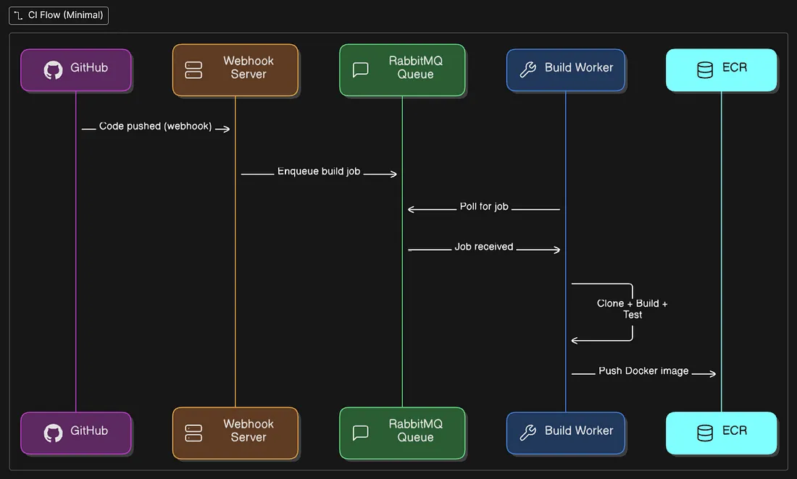

## What is a Webhook (Real Quick)

CI/CD means auto build + deploy when you push code.
But how do we even know someone pushed code? That’s where **GitHub Webhooks** come in.

Basically, **GitHub sends a request to our backend** whenever a push happens. We use this to trigger the redeploy.

---

## Quick Visual



---

## How the Webhook is Created (Automatically)

When you connect your GitHub repo for deployment, we create a webhook under the hood — **no manual setup needed**.

This is possible because when you connect your GitHub account, you give permission for repo access. We use your token to create a webhook.

Here’s the code that does it:

```ts
// backend/src/github/github.service.ts

async createWebhook(repo: string, webhookUrl: string, token: string) {
  const [owner, name] = repo.split('/');
  const url = `https://api.github.com/repos/${owner}/${name}/hooks`;

  await axios.post(
    url,
    {
      name: 'web',
      active: true,
      events: ['push'], // fire only on push
      config: {
        url: webhookUrl,
        content_type: 'json',
        secret: process.env.GITHUB_WEBHOOK_SECRET,
        insecure_ssl: '0',
      },
    },
    {
      headers: {
        Authorization: `token ${token}`,
        Accept: 'application/vnd.github.v3+json',
      },
    }
  );
}
```

**Key points:**

* We create webhook for `push` events only.
* The webhook sends a JSON payload to our backend.
* We add a `secret` to validate that it’s GitHub calling us, not random bots.

---

## Webhook Request Comes In, What Happens Next?

When GitHub sends the webhook, our backend first **verifies the signature** using the secret. Here's how:

```ts
// backend/src/github/github.service.ts

verifySignature(payload: any, signature: string): boolean {
  const secret = process.env.GITHUB_WEBHOOK_SECRET!;
  const expected = 'sha256=' + 
    crypto.createHmac('sha256', secret)
      .update(JSON.stringify(payload))
      .digest('hex');
  return expected === signature;
}
```

**Why?** To make sure it’s actually GitHub hitting our endpoint, not someone trying to mess with our system.

---

## Matching Repo + Branch → Trigger Redeploy

If signature is valid, we process the webhook payload:

```ts
async processPayload(payload) {
  const repo = payload.repository.full_name;
  const branch = payload.ref.replace('refs/heads/', '');

  const deployment = await findMatchingDeployment(repo, branch);
  if (!deployment) return;

  for (const version of deployment.version) {
    if (version.autoDeploy) {
      triggerRedeploy(version.id);
    }
  }
}
```

### What this does:

1. Finds if this repo + branch matches any deployment in DB.
2. If yes, and **autoDeploy = true**, then it calls `triggerRedeploy()`, which kills the old container, rebuilds, and pushes to ECR.

---

## 🛡️ Protecting Our Endpoint

Because we’re exposing an endpoint to GitHub, we **must protect it**.
That’s why the webhook secret is super important and used in signature verification.


---

## Why Not GitHub Apps (like Vercel)?

Because I use **Personal Access Token (PAT)**, you can **see the webhook in your repo settings**.
Vercel uses **GitHub Apps**, so no visible webhook — they get events via GitHub API behind the scenes.

Difference?

* PAT: "Here’s my token, do stuff as me."
* GitHub App: "I’m an app, I have my own permissions."

 // using PAT
