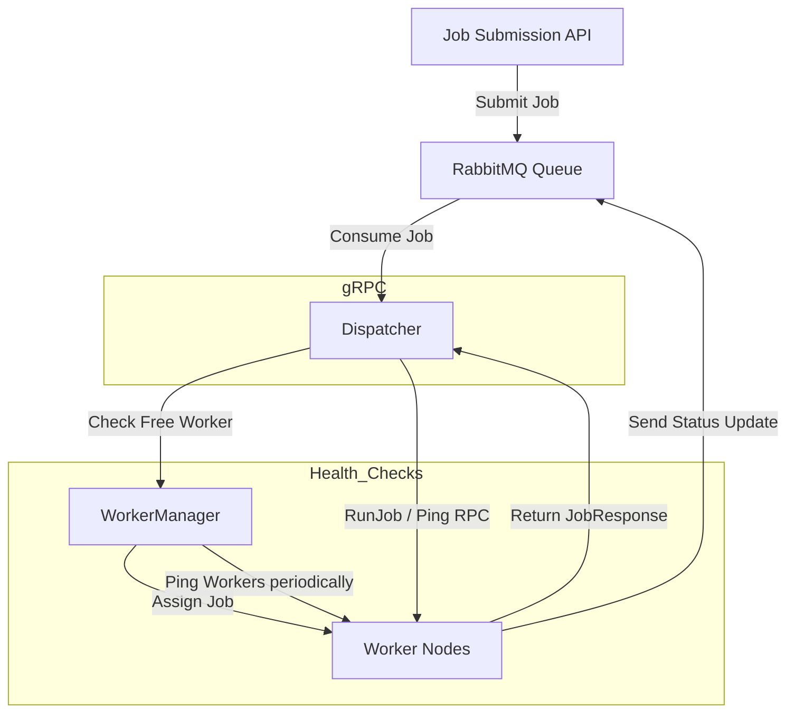

# **Architecture & Design**



## **1. High-Level Overview**

The **Blacktree Orchestrator** is a distributed build orchestrator that coordinates multiple worker nodes to build Docker images from GitHub repositories. It ensures:

- **Concurrency control** – multiple builds can run in parallel.
- **Worker health management** – only healthy workers are assigned jobs.
- **Context-aware cancellation** – jobs can be safely canceled or retried.
- **Queue-based job orchestration** – RabbitMQ ensures reliable job delivery.

**Conceptual Flow:**

```
[Job Submission API]
          │
          ▼
    [RabbitMQ Queue] ───> [Dispatcher] ──> [Worker Manager] ──> [Worker Nodes]
          │                                       ▲
          │                                       │
          └────────── [Job Acknowledgment] <─────┘
```

---

## **2. Components**

### **2.1 Dispatcher**

- Core orchestrator that listens for jobs from RabbitMQ.
- Checks for available workers using **WorkerManager**.
- Assigns jobs using **ExecuteRunJobRPC**.
- Supports **graceful shutdown** and **context-aware cancellation**.

**Responsibilities:**

- Listen for deployment messages.
- Match jobs to free workers.
- Requeue jobs if no worker is available.
- Track job cancellation contexts.

---

### **2.2 WorkerManager**

- Maintains the **state of all workers** (free, busy, dead).
- Exposes a **buffered channel of free workers**.
- Periodically performs **health checks** via gRPC (`Ping`).
- Handles **worker registration** and **deregistration**.

**Key Features:**

- **Concurrency-safe** using `sync.Mutex`.
- **Persistent gRPC connections** to each worker.
- Free worker queue ensures efficient job assignment.

---

### **2.3 Workers**

- Run on separate nodes (could be Docker containers).
- Expose a gRPC server to receive **RunJob** and **Ping** requests.
- Execute build tasks (Docker builds) and return **JobResponse** with logs & image URL.

**Worker Lifecycle:**

1. Register with orchestrator.
2. Wait for job assignment.
3. Execute job → return result.
4. Update status (free/busy/dead).

---

### **2.4 Messaging Layer (RabbitMQ)**

- **Direct exchange** used for job routing.
- Queues:

  - `execute.queue` – holds job messages.
  - `status.queue` – optional for build results or API consumption.

**Flow:**

- Orchestrator consumes messages from `execute.queue`.
- Jobs acknowledged only after **handoff to a worker**.
- Guarantees **no job is lost** even if a worker fails mid-build.

---

### **2.5 gRPC Coordination**

- **Dispatcher → Worker**: `RunJob` and `Ping`.
- **Worker → Dispatcher**: Registration via `Register`.
- Persistent gRPC connections reduce connection overhead and improve performance.

---

## **3. Concurrency Model**

- **Channels** for communication between dispatcher and workers.
- **Unbuffered job channel** ensures backpressure: dispatcher waits until a worker can accept the job.
- **Buffered free worker channel** allows workers to report readiness asynchronously.
- Health check runs in a separate goroutine every **2 minutes**.

```
+---------------------+
| Dispatcher          |
| JobQueue (chan)     |
+---------+-----------+
          │
          ▼
+---------+-----------+
| WorkerManager       |
| FreeWorkers (chan)  |
+---------+-----------+
          │
          ▼
     [Worker Nodes]
```

---

## **4. Job Lifecycle**

1. Job submitted to **RabbitMQ**.
2. Dispatcher consumes job message.
3. Dispatcher queries **WorkerManager** for a free worker.
4. Job assigned via **ExecuteRunJobRPC**.
5. Worker executes build → returns **JobResponse**.
6. Dispatcher frees worker and optionally reports status.

**Edge Cases Handled:**

- No free worker → job stays in the unbuffered channel until a worker becomes available.
- Worker fails mid-build → worker marked as dead, job can be requeued.
- Orchestrator shutdown → context cancellation stops all in-progress jobs safely.
