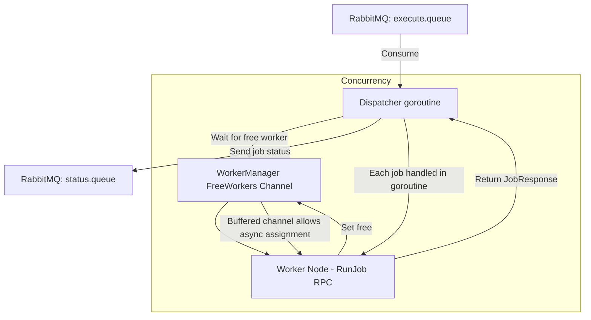

## **Job Assignment & Execution Flow**

When a job message arrives from RabbitMQ, the **Dispatcher** picks it up and assigns it to a free worker from the `WorkerManager`. Once the worker finishes, it reports back, and the worker is automatically returned to the free worker pool.

---

### **1. Dispatcher Consumes Job**

```go
func (d *Dispatcher) Start() {
    msgs, _ := d.rabbitChannel.Consume(
        "execute.queue",
        "",
        false, // manual ack
        false,
        false,
        false,
        nil,
    )

    for msg := range msgs {
        job := parseJob(msg.Body)
        go d.handleJob(job, msg) // new goroutine for each job
    }
}
```

* **Concurrency:**
  Each message is handled in a **separate goroutine** (`go d.handleJob(...)`) so multiple jobs can be processed in parallel.

---

### **2. Assigning Job to a Free Worker**

```go
func (d *Dispatcher) handleJob(job JobRequest, msg amqp.Delivery) {
    worker := <-d.WorkerManager.FreeWorkers // blocks until a free worker is available
    log.Printf("Assigning job %s to worker %s", job.JobID, worker.Info.Id)

    resp, err := worker.RunJobRPC(job) // gRPC call to worker
    if err != nil {
        log.Printf("Job %s failed: %v", job.JobID, err)
    }

    // Send job result back to backend/status queue
    d.publishStatus(resp)

    // Mark worker as free again
    d.WorkerManager.SetWorkerState(worker.Info.Id, "free")

    // Acknowledge message in RabbitMQ
    msg.Ack(false)
}
```

* **Concurrency-safe:**

  * `<-d.WorkerManager.FreeWorkers` ensures **only free workers are assigned**.
  * `SetWorkerState` safely pushes the worker back into the **free workers channel**.

---

### **3. Worker Execution (gRPC)**

```go
func (w *Worker) RunJobRPC(job JobRequest) (*JobResponse, error) {
    // Runs the actual Docker build
    logs, imageURL, err := buildDockerImage(job)
    status := err == nil

    return &JobResponse{
        JobID:    job.JobID,
        Success:  status,
        Logs:     logs,
        ImageURL: imageURL,
        Error:    fmt.Sprintf("%v", err),
    }, nil
}
```

---

### **Mermaid Diagram**



---

### **Key Points**

* **Goroutines**: Each job is handled in a separate goroutine for parallelism.
* **FreeWorkers channel**: Ensures only idle workers are assigned jobs.
* **WorkerManager.SetWorkerState**: Automatically puts workers back in the pool after completion.
* **RabbitMQ acknowledgment**: Jobs are acknowledged **only after assignment & execution**, preventing message loss.

