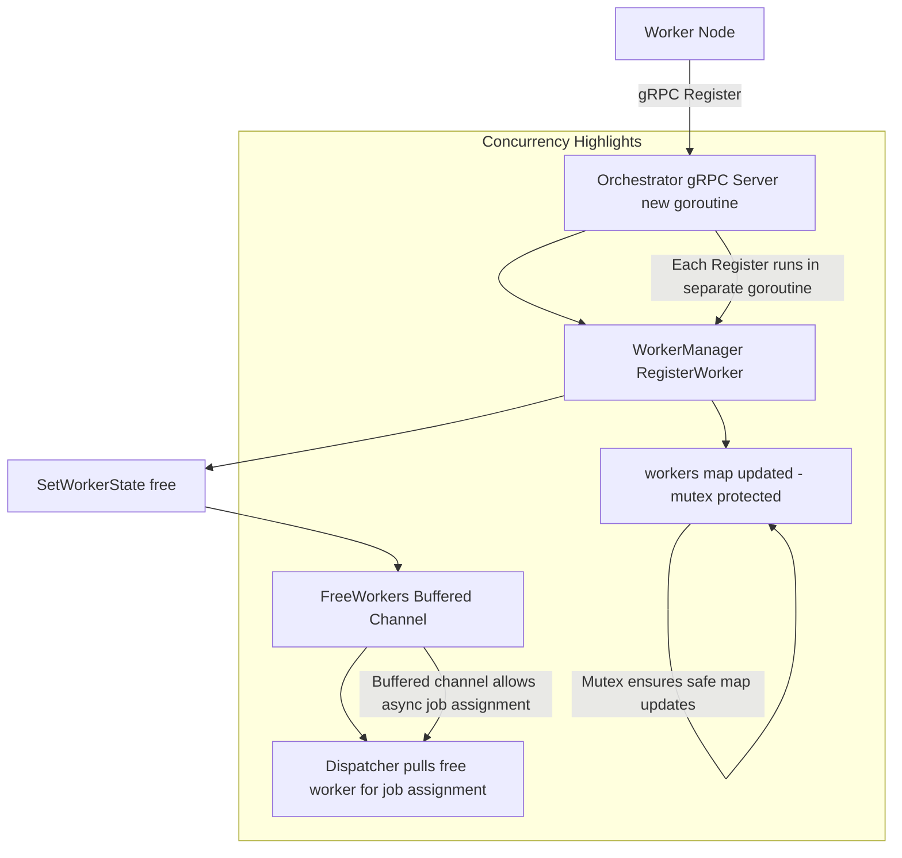

## **Worker Registration & Free Worker Handling**



### **1. Registration Overview**

When a new worker joins the system:

1. The worker sends a gRPC **Register** request to the orchestrator.
2. The **Orchestrator gRPC Server** receives the request.
3. A new goroutine is automatically spawned by gRPC for this request.
4. The server calls **`WorkerManager.RegisterWorker`**, which:

   - Stores worker info in the `workers` map.
   - Opens a **persistent gRPC connection** to the worker.
   - Sets the worker state to `"free"`.
   - Adds the worker to the **`FreeWorkers` buffered channel**.

This ensures the orchestrator can assign jobs immediately to new workers without blocking registration.

---

### **2. Registration Flow Code**

**gRPC Handler (`server.go`):**

```go
func (s *OrchestratorGRPCServer) Register(ctx context.Context, req *workerpb.WorkerInfo) (*workerpb.RegisterAck, error) {
    log.Printf("Received Register request from worker ID: %s", req.Id)
    err := s.Manager.RegisterWorker(ctx, req) // calls WorkerManager
    if err != nil {
        return nil, err
    }
    log.Printf("Successfully registered worker ID: %s", req.Id)
    return &workerpb.RegisterAck{Success: true}, nil
}
```

**WorkerManager Registration (`workerman.go`):**

```go
func (wm *WorkerManager) RegisterWorker(ctx context.Context, info *workerpb.WorkerInfo) error {
    wm.mu.Lock()
    wm.workers[info.Id] = &Worker{
        Info:     info,
        LastSeen: time.Now(),
        state:    "registering",
        GrpcConn: nil,
    }
    wm.mu.Unlock()

    // Open persistent gRPC connection
    conn, err := grpc.NewClient(fmt.Sprintf("%s:%d", info.Ip, info.Port), grpc.WithTransportCredentials(insecure.NewCredentials()))
    if err != nil {
        wm.SetWorkerState(info.Id, "dead")
        return err
    }

    wm.mu.Lock()
    wm.workers[info.Id].GrpcConn = conn
    wm.mu.Unlock()

    // Set worker as free and push to free channel
    wm.SetWorkerState(info.Id, "free")
    log.Printf("Worker %s is now free", info.Id)
    return nil
}
```

---

### **3. How Free Workers Are Managed**

**`SetWorkerState` ensures concurrency-safe updates**:

```go
func (wm *WorkerManager) SetWorkerState(workerID string, state string) {
    wm.mu.Lock()
    defer wm.mu.Unlock()

    worker, exists := wm.workers[workerID]
    if !exists {
        return
    }

    worker.state = state
    if state == "free" {
        select {
        case wm.FreeWorkers <- worker: // push into free worker channel
        default: // channel is full, drop to avoid blocking
        }
    }
}
```

- **Buffered Channel (`FreeWorkers`)**:

  - Workers that are free are put into a channel so the dispatcher can pull a free worker for a job immediately.
  - If multiple workers register at the same time, gRPC spawns a goroutine for each **handler**, so multiple workers can enter the channel **concurrently**.
  - The `sync.Mutex` ensures the `workers` map is safely updated.

---

### **4. Concurrency Highlights**

1. **gRPC Handler Goroutines**

   - Each incoming **Register** request runs in a separate goroutine automatically.
   - This allows hundreds of workers to register at nearly the same time without blocking each other.

2. **WorkerManager Mutex**

   - Protects the `workers` map to avoid race conditions when multiple goroutines read/write simultaneously.

3. **FreeWorkers Buffered Channel**

   - Enables asynchronous job assignment.
   - Dispatcher can pull workers immediately while new workers keep registering.

---

### **5. Flow Diagram**

```
Worker Node
     │
     │ gRPC Register()
     ▼
+---------------------+
| Orchestrator gRPC   |
| Server (goroutine)  |
+----------+----------+
           │
           ▼
+---------------------+
| WorkerManager       |
| workers map updated  |
| SetWorkerState()    |
+----------+----------+
           │
           ▼
  FreeWorkers Channel
           │
           ▼
Dispatcher pulls free worker to assign job
```
