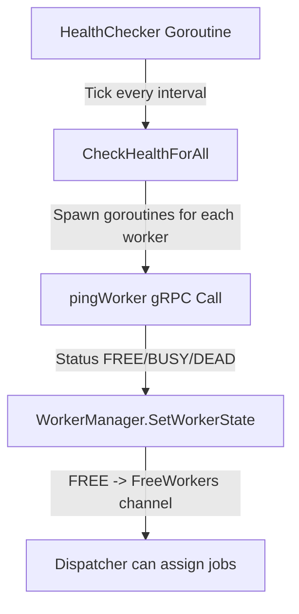

## **Worker Health Checks**

The orchestrator periodically checks all registered workers to ensure they are alive and ready for jobs. This helps in **removing dead workers** and **maintaining concurrency reliability**.

---

### **1. Health Checker Loop**

```go
func (wm *WorkerManager) StartHealthChecker(ctx context.Context, interval time.Duration) {
    ticker := time.NewTicker(interval)
    defer ticker.Stop()

    for {
        select {
        case <-ctx.Done():
            log.Println("Health checker stopped.")
            return
        case <-ticker.C:
            wm.CheckHealthForAll()
        }
    }
}
```

* Runs in a **separate goroutine**.
* Periodically triggers `CheckHealthForAll()` for all workers.

---

### **2. Checking All Workers**

```go
func (wm *WorkerManager) CheckHealthForAll() {
    wm.mu.Lock()
    workersCopy := make([]*Worker, 0, len(wm.workers))
    for _, w := range wm.workers {
        workersCopy = append(workersCopy, w)
    }
    wm.mu.Unlock()

    var wg sync.WaitGroup
    for _, w := range workersCopy {
        wg.Add(1)
        go func(worker *Worker) {
            defer wg.Done()
            wm.pingWorker(worker)
        }(w)
    }
    wg.Wait()
}
```

* **Concurrency:**
  Each worker is pinged in a separate goroutine (`pingWorker`) to avoid blocking.
* `sync.WaitGroup` ensures the function waits until **all workers are checked**.

---

### **3. Ping Worker via gRPC**

```go
func (wm *WorkerManager) pingWorker(w *Worker) {
    ctx, cancel := context.WithTimeout(context.Background(), 3*time.Second)
    defer cancel()

    client := jobpb.NewJobServiceClient(w.GrpcConn)
    resp, err := client.Ping(ctx, &jobpb.PingRequest{})
    if err != nil {
        wm.SetWorkerState(w.Info.Id, "dead")
        return
    }

    switch resp.Status {
    case jobpb.WorkerStatus_FREE:
        wm.SetWorkerState(w.Info.Id, "free")
    case jobpb.WorkerStatus_BUSY:
        wm.SetWorkerState(w.Info.Id, "busy")
    default:
        wm.SetWorkerState(w.Info.Id, "dead")
    }
}
```

* Updates worker state automatically.
* Free workers are **pushed into `FreeWorkers` channel**, ready to receive jobs.

---

### **Mermaid Diagram**



---

### **Key Points**

* Health checks **run independently** from job assignment.
* **Goroutines + WaitGroup** handle multiple workers concurrently.
* Worker state updates ensure the orchestrator **never assigns jobs to dead workers**.
