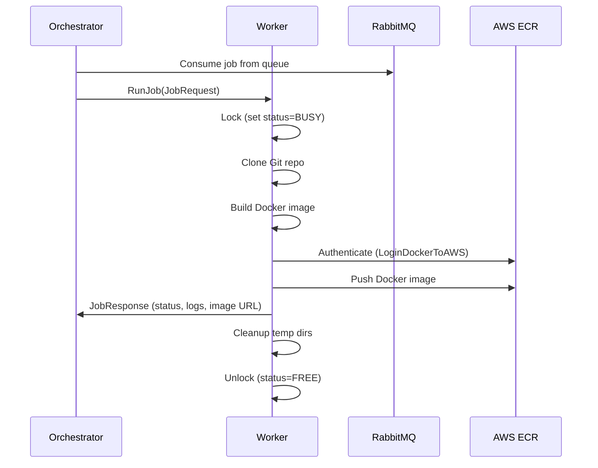

## Job Flow 

This section describes in **full detail** how a deployment job moves through the Blacktree Orchestrator–Worker pipeline, including the relevant code path for better context.

---

### Step-by-Step Flow

1. **Job Submission**

   * The build request enters **RabbitMQ** from the Blacktree API.
   * Payload example:

     ```json
     {
       "repo_url": "username/reponame",
       "branch": "main",
       "deployment_version": "v1.0.3",
       "aws_account": "1234567890",
       "ecr_repo": "app-images"
     }
     ```

2. **Orchestrator Consumes Job**

   * The **Orchestrator** listens on the queue (`jobs.build`) and consumes messages.
   * It parses the payload, validates, and selects an available worker.

3. **RPC Dispatch to Worker**

   * The Orchestrator calls `RunJob(JobRequest)` via gRPC to the Worker.

4. **Worker Processing Flow**

   * On receiving the job, the Worker:

     * Locks itself (`status=BUSY`).
     * Clones the Git repository at the specified branch.
     * Builds a Docker image locally.
     * Authenticates with AWS ECR.
     * Pushes the image to ECR.
     * Sends `JobResponse` back to the Orchestrator.
     * Cleans up build artifacts.
     * Unlocks itself (`status=FREE`).

---

### Sequence Diagram



---

### Example Worker Code for `RunJob`

Below is a simplified version of what happens inside the Worker when a job is received.

```go
func (s *WorkerServer) RunJob(ctx context.Context, req *workerpb.JobRequest) (*workerpb.JobResponse, error) {
    s.lock() // set status=BUSY
    defer s.unlock()

    logs := []string{}
    logStep := func(step string) { logs = append(logs, step) }

    // 1. Clone repository
    logStep(fmt.Sprintf("Cloning repo %s (branch: %s)", req.RepoUrl, req.Branch))
    if err := utils.CloneRepo(req.RepoUrl, req.Branch, s.tempDir); err != nil {
        return s.failResponse(err, logs)
    }

    // 2. Build Docker image
    logStep("Building Docker image...")
    imageTag := fmt.Sprintf("%s:%s", req.EcrRepo, req.DeploymentVersion)
    if err := utils.BuildDockerImage(s.tempDir, imageTag); err != nil {
        return s.failResponse(err, logs)
    }

    // 3. Login to AWS ECR
    logStep("Logging into AWS ECR...")
    if err := utils.LoginDockerToAWS(req.AwsAccountId, req.Region); err != nil {
        return s.failResponse(err, logs)
    }

    // 4. Push image to ECR
    logStep("Pushing image to AWS ECR...")
    if err := utils.PushDockerImage(imageTag); err != nil {
        return s.failResponse(err, logs)
    }

    // 5. Cleanup temp dirs
    logStep("Cleaning up...")
    _ = os.RemoveAll(s.tempDir)

    // 6. Return success
    return &workerpb.JobResponse{
        Status:    "SUCCESS",
        Logs:      logs,
        ImageUrl:  fmt.Sprintf("%s.dkr.ecr.%s.amazonaws.com/%s:%s", req.AwsAccountId, req.Region, req.EcrRepo, req.DeploymentVersion),
    }, nil
}

func (s *WorkerServer) failResponse(err error, logs []string) (*workerpb.JobResponse, error) {
    logs = append(logs, "ERROR: "+err.Error())
    return &workerpb.JobResponse{
        Status: "FAILED",
        Logs:   logs,
    }, err
}
```

---

### Notes on Implementation

* **Locking & Unlocking**
  The `lock()` and `unlock()` methods ensure no two jobs run concurrently on the same Worker.

* **Context Cancellation**
  The `ctx` passed from the Orchestrator can be used to terminate the build if it exceeds time limits.

* **Retry Strategy**
  In production, the Orchestrator can retry failed jobs by requeuing them into RabbitMQ.

* **Logs Handling**
  Logs are accumulated in a slice and returned with the final response for debugging purposes.

