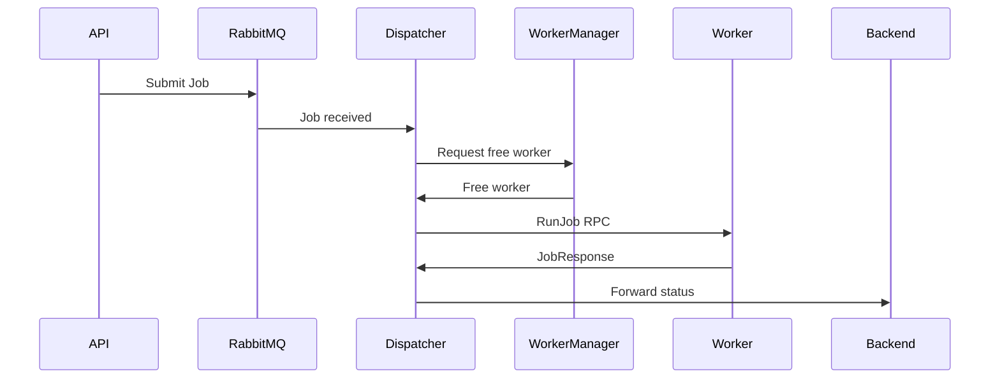
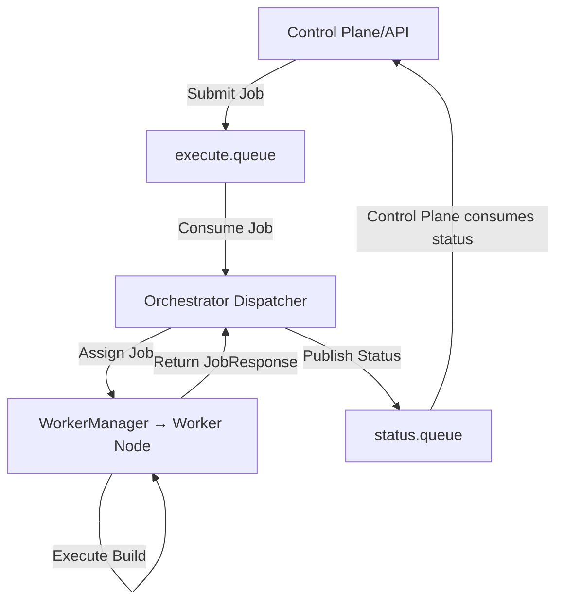
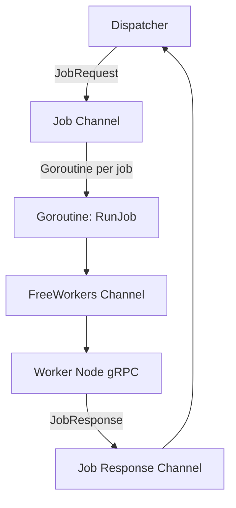

# Job Flow

Blacktree orchestrator is a **backend-agnostic job dispatcher**. It does **not handle retries or failure logic itself** it simply delivers the job to a worker and reports back the result to the control plane.





### **1. Submitting a Job**

Jobs are submitted via a **RabbitMQ queue**:

- **Queue:** `execute.queue`
- **Message:** `JobRequest`

  ```json
  {
    "jobId": "unique-id-123",
    "repoUrl": "user/reponame",
    "branch": "main",
    "dockerfilePath": "Dockerfile",
    "contextDir": ".",
    "imageName": "myapp:latest",
    "githubToken": "<token>"
  }
  ```

- The orchestrator consumes messages from `execute.queue` and **assigns them to free workers**.

---

### **2. Job Execution**

- The dispatcher queries **WorkerManager** for a free worker.

- Assigns the job using **RunJob gRPC call**.

- Worker executes the job (Docker build) and generates a **JobResponse**:

  ```json
  {
    "jobId": "unique-id-123",
    "success": true,
    "logs": "<build logs>",
    "imageUrl": "ecr.amazonaws.com/myapp:latest",
    "error": ""
  }
  ```

- **Important:** Orchestrator does **not retry or fail jobs**. It simply forwards the response to the control plane via the **status reporting RabbitMQ queue**.

---

### **3. Reporting Job Status**

- **Queue:** `status.queue`
- Orchestrator publishes a **JobResponse** message to `status.queue` after job completion.
- The **control plane** is responsible for:

  - Handling failed jobs.
  - Retriggering failed jobs manually or automatically.
  - Updating dashboards or APIs with job results.

---

### **4. Example Flow**



**Key Points:**

- Orchestrator **never retries** jobs; it’s purely a **delivery mechanism**.
- The **control plane** is in charge of monitoring failures and re-submitting jobs if needed.
- Workers maintain state (free/busy/dead) for proper scheduling.


