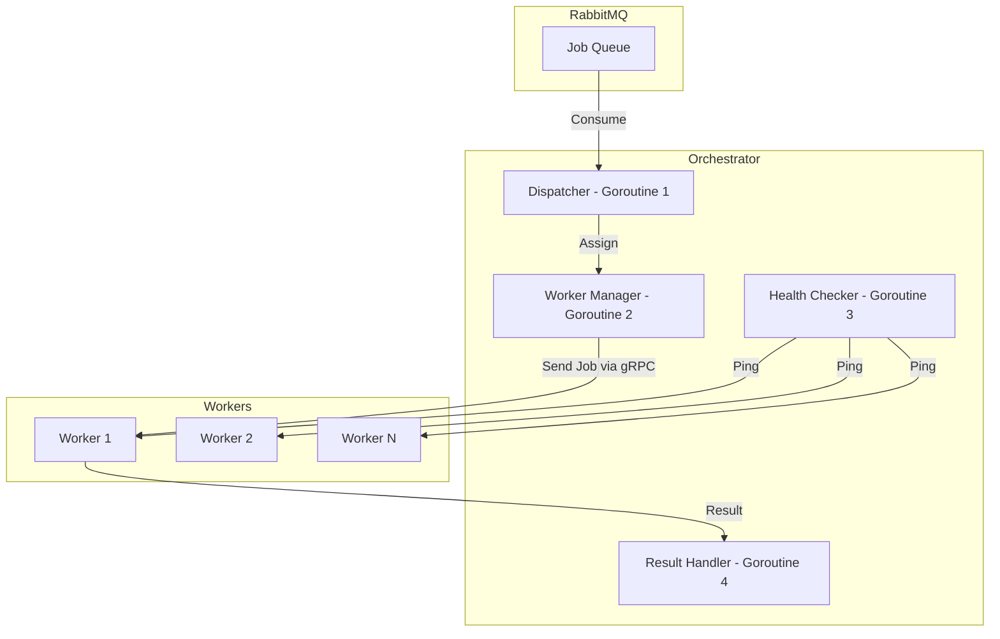

---
title: Worker Design
sidebar_position: 2
---

# **High-Level Design Worker**

## **1. Role in the System**

The **Worker** is a dedicated service responsible for executing build jobs dispatched by the **Orchestrator**.
Its primary function is to:

1. Receive job instructions over **gRPC**.
2. Clone the specified repository.
3. Build a Docker image from the source code.
4. Push the image to an **AWS ECR registry**.
5. Report build status and results back to the Orchestrator.

The Worker is designed to be:

* **Stateless** between jobs (clears temp directories after each build).
* **Self-registering** with the Orchestrator at startup.
* **Region-aware** for optimal deployment targeting.

---

## **2. Architecture Overview**

The system is divided into three main components:

### **a. Message Queue (RabbitMQ)**

* Holds incoming deployment jobs.
* Consumed by the Orchestrator’s **Dispatcher**.
* Decouples API requests from actual build execution.

### **b. Orchestrator**

* **Dispatcher (Goroutine 1):** Pulls jobs from RabbitMQ and determines worker assignment.
* **Worker Manager (Goroutine 2):** Tracks availability of workers.
* **Health Checker (Goroutine 3):** Periodically pings all workers via gRPC to verify status (`FREE` or `BUSY`).
* **Result Handler (Goroutine 4):** Collects job completion responses and updates system state.

### **c. Workers**

* Multiple worker instances run in parallel across regions.
* Each worker:

  1. Registers with the Orchestrator at startup.
  2. Listens for incoming **`RunJob`** gRPC calls.
  3. Executes the build → push pipeline.
  4. Sends back a structured job result.

---

## **3. Flow of Execution**

Below is the logical sequence of how a job moves through the system:

---

## **4. Worker Lifecycle**

1. **Startup**

   * Load environment variables.
   * Generate Worker ID (if not provided).
   * Determine local IP and listening port.
   * Start the gRPC server in a separate goroutine.
   * Register with the Orchestrator.

2. **Idle State**

   * Worker is marked as `FREE` in Orchestrator.
   * Responds to health pings.

3. **Job Assignment**

   * Orchestrator sends a `RunJob` request via gRPC.
   * Worker transitions to `BUSY` state.

4. **Job Execution Pipeline**

   * Clone repository (supports private repos via token injection).
   * Build Docker image using BuildKit script.
   * Authenticate to AWS ECR and obtain temporary credentials.
   * Tag and push the image to the appropriate ECR repository.

5. **Completion & Reporting**

   * Return `JobResponse` with success/failure status, logs, and image URL.
   * Transition back to `FREE` state.

---

## **5. Communication Model**

* **Orchestrator → Worker**

  * `RunJob(JobRequest)` — triggers a build.
  * `Ping(PingRequest)` — checks health and availability.
* **Worker → Orchestrator**

  * Returns `JobResponse` after job completion.
  * Registration call at startup (`Register(WorkerInfo)`).

---

## **6. Key Design Considerations**

* **Isolation:** Workers run builds in isolated environments to prevent cross-job contamination.
* **Statelessness:** No persistent state is stored on the worker beyond job execution.
* **Extensibility:** Easy to add more worker nodes in different regions.
* **Fault Tolerance:** Health checker ensures failed or unresponsive workers are excluded from scheduling.
* **Scalability:** Horizontal scaling by adding more worker instances.
